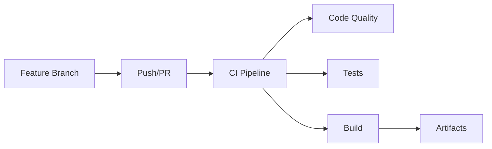
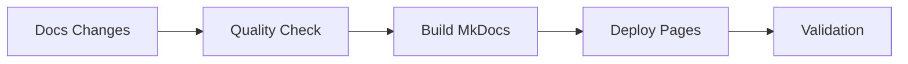
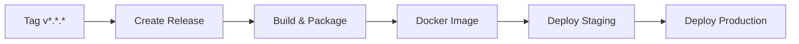

# 🚀 CI/CD Guide - Tech Challenge Restaurants

## 📋 Visão Geral

Este projeto utiliza GitHub Actions para implementar um pipeline completo de CI/CD com três workflows principais:

- **🔨 CI (Continuous Integration)** - Build, testes e qualidade de código
- **📚 Documentation Deployment** - Deploy automático da documentação
- **🚀 Release & Deploy** - Criação de releases e deploy em ambientes

## 🔧 Workflows Disponíveis

### 1. 🔨 Continuous Integration (`ci.yml`)

**Triggers:**
- Push em qualquer branch
- Pull requests para `main` e `develop`

**Jobs:**
- **🔍 Code Quality & Security**: Análise de código e vulnerabilidades
- **🧪 Build & Test**: Testes unitários e de integração (matriz de perfis)
- **🚀 Build Application**: Compilação e geração de artefatos
- **📈 Code Coverage**: Relatório de cobertura de código (apenas main)
- **📋 Build Summary**: Resumo consolidado dos resultados

**Artefatos Gerados:**
- `application-jar` - JAR da aplicação (30 dias)
- `test-results-*` - Resultados dos testes (7 dias)
- `build-reports` - Relatórios de build (7 dias)
- `coverage-reports` - Relatórios de cobertura (30 dias)

### 2. 📚 Documentation Deployment (`docs-deploy.yml`)

**Triggers:**
- Push na `main` com mudanças em `docs/`, `mkdocs.yml` ou `README.md`
- Pull requests com mudanças na documentação
- Execução manual (`workflow_dispatch`)

**Jobs:**
- **🔍 Documentation Quality**: Validação de markdown e links
- **🏗️ Build Documentation**: Construção do site MkDocs
- **🚀 Deploy to GitHub Pages**: Deploy automático (apenas main)
- **✅ Validate Deployment**: Verificação pós-deploy
- **📢 Notification**: Notificações e resumos

**Recursos:**
- ✅ Geração automática de PDF
- ✅ Validação de links quebrados
- ✅ Otimização e minificação
- ✅ Suporte a Mermaid diagrams
- ✅ Preview para Pull Requests

### 3. 🚀 Release & Deploy (`release.yml`)

**Triggers:**
- Push de tags `v*.*.*`
- Execução manual com parâmetros

**Jobs:**
- **📦 Create Release**: Criação de release no GitHub
- **🏗️ Build & Package**: Build e empacotamento
- **🐳 Build Docker Image**: Construção de imagem Docker
- **🚀 Deploy to Staging**: Deploy em ambiente de staging
- **🌟 Deploy to Production**: Deploy em produção
- **📋 Post-Release Tasks**: Tarefas pós-release

**Artefatos:**
- JAR da aplicação
- Imagem Docker multi-arquitetura
- Informações de build (JSON)
- Changelog automático

## 🔄 Fluxo de Trabalho

### Desenvolvimento


### Documentação


### Release


## 🛠️ Configuração

### Pré-requisitos
- Java 21
- MongoDB 6.0+
- Python 3.11+ (para docs)
- Docker (para containerização)

### Secrets Necessários
- `GITHUB_TOKEN` - Automático do GitHub
- Adicionar outros secrets conforme necessário para deploy

### Ambientes
- **staging** - Ambiente de homologação
- **production** - Ambiente de produção

## 📊 Monitoramento

### Badges de Status
Adicione ao README principal:

```markdown


```

### Métricas Disponíveis
- ✅ Cobertura de código
- ✅ Tempo de build
- ✅ Qualidade de código
- ✅ Vulnerabilidades de segurança
- ✅ Status de deploy

## 🔧 Personalização

### Modificar Triggers
Edite a seção `on:` nos arquivos YAML:

```yaml
on:
  push:
    branches: [ main, develop, feature/* ]
  pull_request:
    branches: [ main ]
```

### Adicionar Novos Jobs
```yaml
new-job:
  name: 🆕 New Job
  runs-on: ubuntu-latest
  needs: previous-job
  steps:
    - name: 📥 Checkout
      uses: actions/checkout@v4
    # ... seus steps
```

### Configurar Notificações
Adicione steps de notificação:

```yaml
- name: 📢 Notify Slack
  if: failure()
  uses: 8398a7/action-slack@v3
  with:
    status: failure
    webhook_url: ${{ secrets.SLACK_WEBHOOK }}
```

## 🐛 Troubleshooting

### Problemas Comuns

1. **Build falha por dependências**
   - Verificar cache do Gradle
   - Limpar e rebuildar: `./gradlew clean build`

2. **Testes falham no CI**
   - Verificar configuração do MongoDB
   - Checar variáveis de ambiente

3. **Deploy da documentação falha**
   - Verificar sintaxe do markdown
   - Validar configuração do mkdocs.yml

4. **Docker build falha**
   - Verificar Dockerfile
   - Checar permissões de registry

### Logs e Debugging

- Acesse **Actions** no GitHub
- Clique no workflow com falha
- Expanda os steps para ver logs detalhados
- Use `--debug` ou `--info` nos comandos Gradle

## 📚 Recursos Adicionais

- [GitHub Actions Documentation](https://docs.github.com/en/actions)
- [MkDocs Material](https://squidfunk.github.io/mkdocs-material/)
- [Docker Multi-platform builds](https://docs.docker.com/build/building/multi-platform/)
- [Gradle Build Scans](https://gradle.com/build-scans/)

---

**📅 Última atualização**: 2024-08-05  
**🔧 Versão**: 1.0.0  
**👤 Autor**: Ítalo Moura
