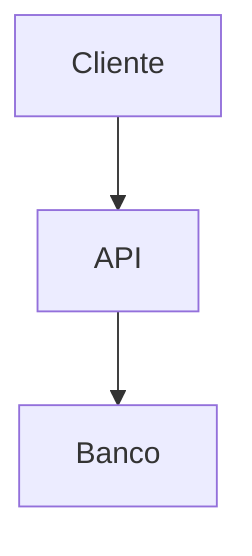

# 📚 Documentação - Guia Completo

Este arquivo contém todas as instruções para trabalhar com a documentação do projeto Tech Challenge Restaurant API.

## 🌐 Documentação Online

A documentação completa está disponível online em:
**https://itmoura.github.io/fiap-tech-challenge-restaurants/**

## 📁 Estrutura da Documentação

```
docs/
├── index.md                    # Página inicial
├── installation/               # Guias de instalação
│   ├── prerequisites.md        # Pré-requisitos
│   ├── local-setup.md         # Configuração local
│   ├── docker.md              # Docker
│   └── testing.md             # Testes
├── api/                       # Documentação da API
│   ├── overview.md            # Visão geral
│   ├── kitchen-types.md       # Kitchen Types API
│   ├── restaurants.md         # Restaurants API
│   ├── menu-categories.md     # Menu Categories API
│   ├── menu-items.md          # Menu Items API
│   └── status-codes.md        # Códigos de status
├── architecture/              # Arquitetura
│   ├── overview.md            # Visão geral
│   ├── clean-architecture.md  # Clean Architecture
│   └── data-modeling.md       # Modelagem de dados
├── about/                     # Sobre o projeto
│   ├── author.md              # Autor
│   ├── license.md             # Licença
│   └── changelog.md           # Changelog
└── assets/                    # Assets
    ├── extra.css              # CSS customizado
    ├── extra.js               # JavaScript customizado
    ├── favicon.ico            # Favicon
    └── logo.png               # Logo
```

## 🚀 Como Executar Localmente

### Opção 1: Script Automático (Recomendado)

```bash
# Executar servidor de desenvolvimento
./serve-docs.sh
```

Este script irá:
- ✅ Verificar dependências
- ✅ Criar ambiente virtual Python
- ✅ Instalar MkDocs e plugins
- ✅ Iniciar servidor com live reload
- ✅ Abrir em http://localhost:8000

### Opção 2: Manual

```bash
# Criar ambiente virtual
python3 -m venv venv
source venv/bin/activate

# Instalar dependências
pip install -r requirements.txt

# Servir documentação
mkdocs serve
```

## 🏗️ Como Gerar Site Estático

### Opção 1: Script Automático

```bash
# Gerar site estático
./build-docs.sh

# Com PDF (se disponível)
ENABLE_PDF=true ./build-docs.sh
```

### Opção 2: Manual

```bash
# Ativar ambiente virtual
source venv/bin/activate

# Gerar site
mkdocs build

# Com PDF
ENABLE_PDF_EXPORT=true mkdocs build
```

O site será gerado na pasta `site/`.

## 📝 Como Editar a Documentação

### 1. Estrutura dos Arquivos

Todos os arquivos de documentação estão em `docs/` e usam **Markdown**.

### 2. Sintaxe Especial

#### Admonitions (Caixas de Destaque)

```markdown
!!! note "Nota"
    Esta é uma nota informativa.

!!! warning "Atenção"
    Esta é uma mensagem de atenção.

!!! tip "Dica"
    Esta é uma dica útil.
```

#### Tabs

```markdown
=== "Linux"
    ```bash
    sudo apt install package
    ```

=== "macOS"
    ```bash
    brew install package
    ```

=== "Windows"
    ```bash
    choco install package
    ```
```

#### Diagramas Mermaid

```markdown

```

### 3. Adicionando Novas Páginas

1. Crie o arquivo `.md` na pasta apropriada
2. Adicione ao `mkdocs.yml` na seção `nav:`

```yaml
nav:
  - Nova Seção:
    - Nova Página: nova-secao/nova-pagina.md
```

### 4. Adicionando Imagens

1. Coloque imagens em `docs/assets/`
2. Referencie no markdown:

```markdown

```

## 🎨 Customização Visual

### CSS Customizado

Edite `docs/assets/extra.css` para personalizar estilos.

### JavaScript Customizado

Edite `docs/assets/extra.js` para adicionar funcionalidades.

### Tema

O tema é configurado em `mkdocs.yml`:

```yaml
theme:
  name: material
  palette:
    - scheme: default
      primary: indigo
      accent: indigo
```

## 🚀 Deploy Automático

### GitHub Pages

O deploy é automático via GitHub Actions quando você faz push para `main`:

1. Edite arquivos em `docs/`
2. Commit e push para `main`
3. GitHub Actions irá:
   - ✅ Instalar dependências
   - ✅ Gerar site estático
   - ✅ Gerar PDF (se possível)
   - ✅ Deploy para GitHub Pages

### Configuração Manual

Se precisar configurar manualmente:

1. Vá em Settings > Pages no GitHub
2. Source: GitHub Actions
3. O workflow `.github/workflows/deploy-docs.yml` cuidará do resto

## 📄 Geração de PDF

### Automática (GitHub Actions)

O PDF é gerado automaticamente no deploy e fica disponível em:
`https://itmoura.github.io/fiap-tech-challenge-restaurants/pdf/documentation.pdf`

### Local

```bash
# Instalar dependências PDF
pip install mkdocs-with-pdf weasyprint

# Gerar com PDF
ENABLE_PDF_EXPORT=true mkdocs build
```

O PDF será gerado em `site/pdf/documentation.pdf`.

## 🔧 Configuração Avançada

### mkdocs.yml

Arquivo principal de configuração:

```yaml
site_name: Nome do Site
site_description: Descrição
site_author: Autor
site_url: https://url.com

theme:
  name: material
  # configurações do tema

plugins:
  - search
  - with-pdf  # Para PDF
  - minify    # Para otimização

markdown_extensions:
  - admonition
  - pymdownx.superfences
  # outras extensões
```

### Plugins Disponíveis

- **search**: Busca integrada
- **with-pdf**: Geração de PDF
- **minify**: Minificação de HTML/CSS/JS
- **mermaid2**: Diagramas Mermaid
- **git-revision-date**: Data de modificação

## 🐛 Troubleshooting

### Problemas Comuns

#### 1. Erro de dependências Python

```bash
# Limpar ambiente virtual
rm -rf venv
python3 -m venv venv
source venv/bin/activate
pip install --upgrade pip
pip install -r requirements.txt
```

#### 2. PDF não gera

```bash
# Instalar dependências do sistema (Ubuntu/Debian)
sudo apt-get install python3-dev python3-pip python3-cffi python3-brotli libpango-1.0-0 libharfbuzz0b libpangoft2-1.0-0

# Instalar weasyprint
pip install weasyprint
```

#### 3. Porta em uso

```bash
# Usar porta diferente
mkdocs serve -a localhost:8001
```

#### 4. Erro de build

```bash
# Build com debug
mkdocs build --verbose --clean
```

### Logs e Debug

```bash
# Verificar configuração
mkdocs config

# Servir com debug
mkdocs serve --verbose

# Build com debug
mkdocs build --verbose
```

## 📊 Métricas e Analytics

### Estatísticas Locais

```bash
# Contar arquivos
find docs -name "*.md" | wc -l

# Tamanho da documentação
du -sh docs/

# Estatísticas do build
du -sh site/
find site -name "*.html" | wc -l
```

### Analytics Online

Para adicionar Google Analytics, edite `mkdocs.yml`:

```yaml
extra:
  analytics:
    provider: google
    property: G-XXXXXXXXXX
```

## 🤝 Contribuindo

### Para Contribuir com a Documentação

1. Fork o repositório
2. Crie uma branch: `git checkout -b docs/nova-feature`
3. Edite arquivos em `docs/`
4. Teste localmente: `./serve-docs.sh`
5. Commit: `git commit -m "docs: adiciona nova seção"`
6. Push: `git push origin docs/nova-feature`
7. Abra Pull Request

### Padrões de Commit

```
docs: adiciona nova seção sobre X
docs: corrige typo na página Y
docs: atualiza screenshots da API
docs: melhora navegação
```

## 📞 Suporte

### Problemas com Documentação

- **GitHub Issues**: [Abrir issue](https://github.com/itmoura/fiap-tech-challenge-restaurants/issues)
- **Discussões**: [GitHub Discussions](https://github.com/itmoura/fiap-tech-challenge-restaurants/discussions)

### Contato

- **LinkedIn**: [linkedin.com/in/itmoura](https://www.linkedin.com/in/itmoura/)
- **GitHub**: [@itmoura](https://github.com/itmoura)

---

## 📋 Checklist de Manutenção

### Mensal
- [ ] Verificar links quebrados
- [ ] Atualizar screenshots se necessário
- [ ] Revisar informações desatualizadas
- [ ] Verificar se PDF está sendo gerado

### A cada Release
- [ ] Atualizar changelog
- [ ] Atualizar versões nas instruções
- [ ] Adicionar novas funcionalidades à documentação
- [ ] Verificar se todos os endpoints estão documentados

### Anual
- [ ] Revisar estrutura geral
- [ ] Atualizar dependências do MkDocs
- [ ] Considerar melhorias de design
- [ ] Avaliar feedback dos usuários

---

<div align="center">
  <p><strong>Documentação mantida com ❤️</strong></p>
  <p>Se você encontrou algum problema ou tem sugestões, por favor abra uma issue!</p>
</div>
