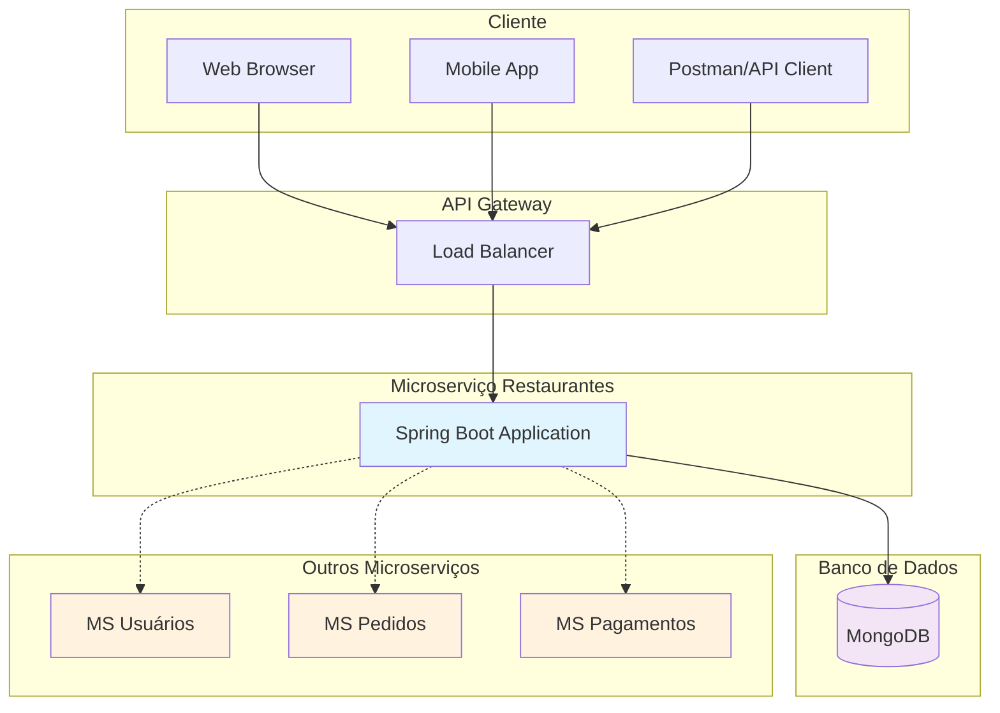
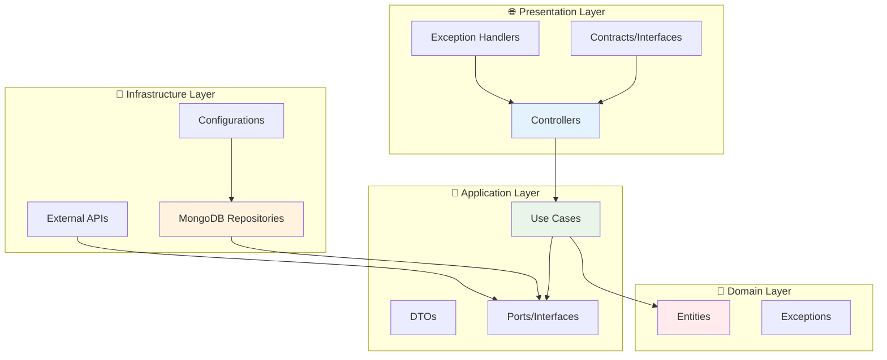
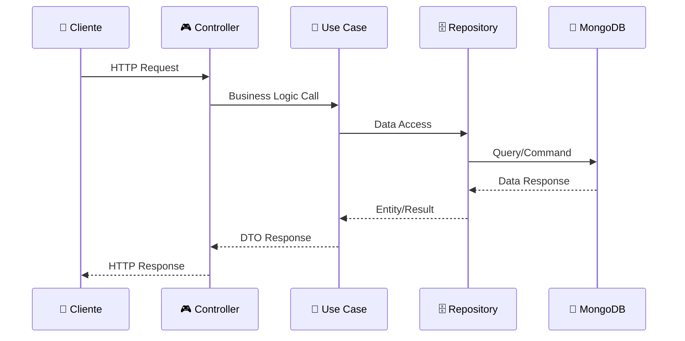
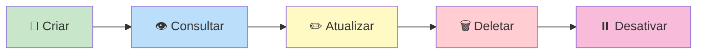
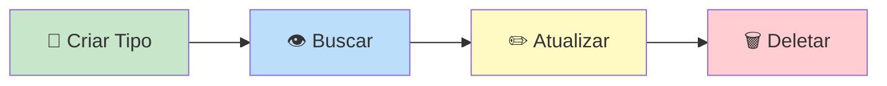
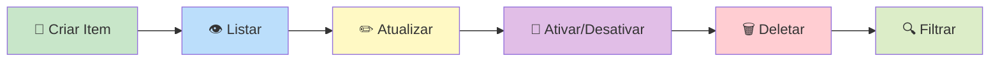
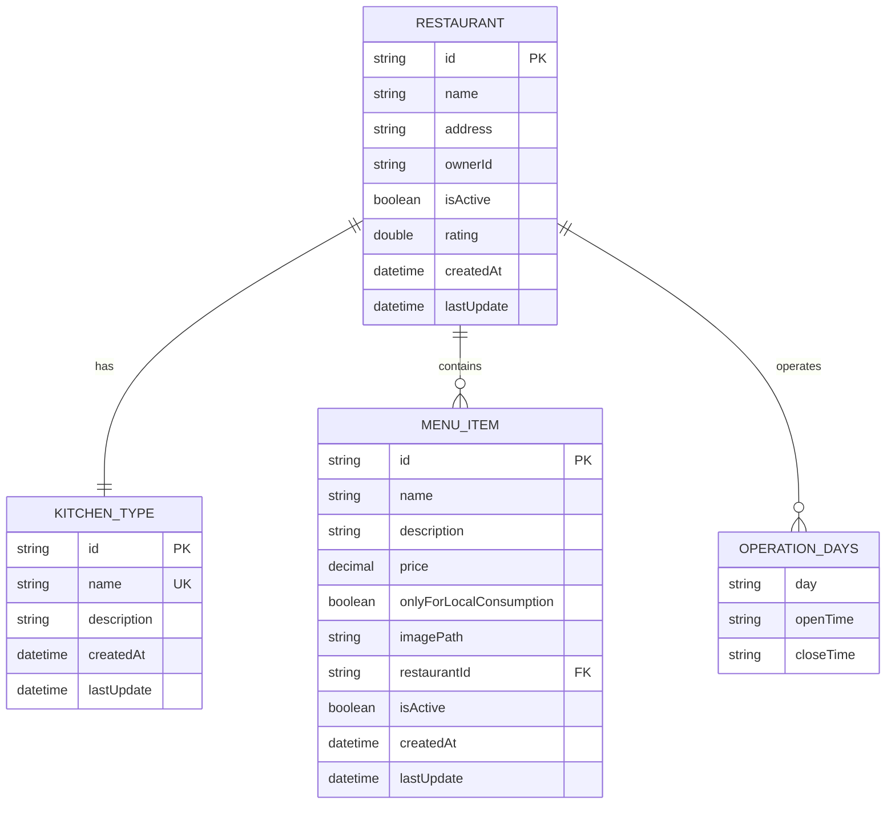
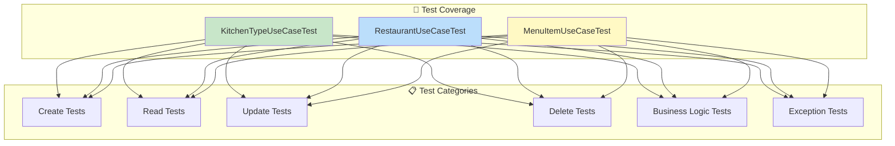
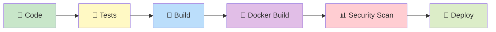

# 🍽️ Tech Challenge - Sistema de Gestão de Restaurantes

## 📋 Descrição do Projeto

Este projeto é um **microserviço** de gestão para restaurantes desenvolvido como parte do Tech Challenge da FIAP. O sistema permite que restaurantes gerenciem suas operações de forma eficiente, incluindo cadastro de restaurantes, tipos de cozinha e itens do cardápio.

## 🏗️ Arquitetura do Sistema

### Visão Geral da Arquitetura



### Clean Architecture - Camadas



### Fluxo de Dados



## 🏛️ Estrutura de Camadas

### 📁 Organização do Código

```
src/main/java/com/fiap/itmoura/tech_challenge_restaurant/
├── 🎯 domain/                 # Camada de Domínio
│   ├── entities/             # Entidades de negócio
│   │   ├── RestaurantEntity.java
│   │   ├── KitchenTypeEntity.java
│   │   ├── MenuItemEntity.java
│   │   └── OperationDaysTimeData.java
│   └── exceptions/           # Exceções de domínio
│       ├── NotFoundException.java
│       ├── ConflictRequestException.java
│       └── BadRequestException.java
├── 💼 application/           # Camada de Aplicação
│   ├── models/              # DTOs e modelos
│   │   ├── restaurant/
│   │   ├── kitchentype/
│   │   └── menuitem/
│   ├── ports/               # Interfaces (Ports)
│   │   └── out/
│   │       ├── RestaurantRepository.java
│   │       ├── KitchenTypeRepository.java
│   │       └── MenuItemRepository.java
│   └── usecases/            # Casos de uso
│       ├── RestaurantUseCase.java
│       ├── KitchenTypeUseCase.java
│       └── MenuItemUseCase.java
└── 🌐 presentation/         # Camada de Apresentação
    ├── controllers/         # Controllers REST
    ├── contracts/           # Interfaces dos controllers
    └── handlers/            # Handlers de exceção
```

### 🔄 Padrões Arquiteturais Utilizados

#### **Clean Architecture**
- **Separação clara de responsabilidades**
- **Inversão de dependências**
- **Testabilidade**
- **Independência de frameworks**

#### **Hexagonal Architecture (Ports & Adapters)**
- **Ports**: Interfaces que definem contratos
- **Adapters**: Implementações concretas dos ports
- **Isolamento da lógica de negócio**

#### **CQRS (Command Query Responsibility Segregation)**
- **Separação entre comandos e consultas**
- **Otimização específica para cada operação**

## 🛠️ Tecnologias Utilizadas

### **Backend**
- ☕ **Java 21** - Linguagem de programação
- 🍃 **Spring Boot 3.5.4** - Framework principal
- 📊 **Spring Data MongoDB** - Persistência de dados
- ✅ **Spring Validation** - Validação de dados
- 🌐 **Spring Web** - APIs REST

### **Banco de Dados**
- 🍃 **MongoDB 7.0** - Banco de dados NoSQL
- 📝 **Collections**: restaurants, kitchen_types, menu_items

### **Ferramentas de Build e Deploy**
- 🐘 **Gradle 8.14.3** - Gerenciamento de dependências
- 🐳 **Docker & Docker Compose** - Containerização
- 📋 **Multi-stage Dockerfile** - Otimização de imagem

### **Documentação e Testes**
- 📚 **Swagger/OpenAPI 3** - Documentação da API
- 🧪 **JUnit 5** - Testes unitários
- 🎭 **Mockito** - Mocks para testes
- 📮 **Postman** - Testes de API

### **Monitoramento**
- 📊 **Spring Actuator** - Health checks e métricas
- 🔍 **Logging** - SLF4J + Logback

## 🚀 Funcionalidades Implementadas

### 🏪 **Gestão de Restaurantes**


**Campos do Restaurante:**
- 🏷️ Nome
- 📍 Endereço  
- 🍳 Tipo de cozinha
- ⏰ Horário de funcionamento
- 👤 ID do dono (referência externa)
- ⭐ Avaliação
- ✅ Status ativo/inativo

### 🍳 **Gestão de Tipos de Cozinha**


**Campos do Tipo de Cozinha:**
- 🏷️ Nome (único)
- 📝 Descrição

### 🍽️ **Gestão de Itens do Cardápio**


**Campos do Item do Cardápio:**
- 🏷️ Nome
- 📝 Descrição
- 💰 Preço
- 🏪 Disponibilidade apenas no local
- 📸 Caminho da imagem
- 🏪 ID do restaurante
- ✅ Status ativo/inativo

## 📡 Endpoints da API

### 🍳 Kitchen Types
```http
POST   /api/kitchen-types/create           # Criar tipo de cozinha
GET    /api/kitchen-types/{idOrName}       # Buscar por ID ou nome
PUT    /api/kitchen-types/{id}/update      # Atualizar tipo
DELETE /api/kitchen-types/{id}/delete      # Deletar tipo
```

### 🏪 Restaurants
```http
POST   /api/restaurants/create             # Criar restaurante
GET    /api/restaurants                    # Listar restaurantes ativos
GET    /api/restaurants/{id}               # Buscar por ID
PUT    /api/restaurants/{id}/update        # Atualizar restaurante
PATCH  /api/restaurants/{id}/disable       # Desativar restaurante
DELETE /api/restaurants/{id}/delete        # Deletar restaurante
```

### 🍽️ Menu Items
```http
POST   /api/menu-items/create              # Criar item do cardápio
GET    /api/menu-items                     # Listar itens (com filtros)
GET    /api/menu-items/{id}                # Buscar por ID
PUT    /api/menu-items/{id}/update         # Atualizar item
PATCH  /api/menu-items/{id}/toggle-status  # Ativar/desativar item
DELETE /api/menu-items/{id}/delete         # Deletar item
```

### 🔍 Filtros Disponíveis para Menu Items
```http
GET /api/menu-items?restaurantId={id}           # Por restaurante
GET /api/menu-items?activeOnly=true             # Apenas ativos
GET /api/menu-items?restaurantId={id}&activeOnly=true  # Combinado
```

## 🗄️ Modelo de Dados

### 📊 Diagrama de Entidades



### 📝 Collections MongoDB

#### **restaurants**
```json
{
  "_id": "ObjectId",
  "name": "String",
  "address": "String", 
  "kitchenType": {
    "id": "String",
    "name": "String",
    "description": "String"
  },
  "daysOperation": [
    {
      "day": "MONDAY|TUESDAY|...",
      "openTime": "HH:mm",
      "closeTime": "HH:mm"
    }
  ],
  "ownerId": "String",
  "isActive": "Boolean",
  "rating": "Double",
  "createdAt": "DateTime",
  "lastUpdate": "DateTime"
}
```

#### **kitchen_types**
```json
{
  "_id": "ObjectId",
  "name": "String (unique)",
  "description": "String",
  "createdAt": "DateTime",
  "lastUpdate": "DateTime"
}
```

#### **menu_items**
```json
{
  "_id": "ObjectId",
  "name": "String",
  "description": "String",
  "price": "Decimal",
  "onlyForLocalConsumption": "Boolean",
  "imagePath": "String",
  "restaurantId": "String",
  "isActive": "Boolean",
  "createdAt": "DateTime",
  "lastUpdate": "DateTime"
}
```

## 🧪 Testes

### 📊 Cobertura de Testes

O projeto possui **cobertura abrangente de testes unitários** para os principais casos de uso:



### 🎯 Tipos de Testes Implementados

#### **Testes Unitários**
- ✅ **Create Operations** - Criação de entidades
- ✅ **Read Operations** - Consultas e buscas
- ✅ **Update Operations** - Atualizações
- ✅ **Delete Operations** - Remoções
- ✅ **Business Logic** - Regras de negócio
- ✅ **Exception Handling** - Tratamento de erros
- ✅ **Validation Tests** - Validações de entrada
- ✅ **Edge Cases** - Casos extremos

#### **Estrutura dos Testes**
```java
@ExtendWith(MockitoExtension.class)
@DisplayName("UseCase Tests")
class UseCaseTest {
    
    @Nested
    @DisplayName("Create Tests")
    class CreateTests { /* ... */ }
    
    @Nested
    @DisplayName("Read Tests") 
    class ReadTests { /* ... */ }
    
    // ... outros grupos de testes
}
```

### 🚀 Executando os Testes

```bash
# Executar todos os testes
./run.sh test

# Ou usando Gradle diretamente
./gradlew test

# Gerar relatório de cobertura
./gradlew test jacocoTestReport
```

## 🐳 Configuração e Execução

### 📋 Pré-requisitos

- 🐳 **Docker** e **Docker Compose**
- ☕ **Java 21** (para desenvolvimento local)
- 🐘 **Gradle** (para desenvolvimento local)

### 🚀 Execução com Docker Compose

#### **1. Clone o repositório:**
```bash
git clone https://github.com/itmoura/fiap-tech-challenge-restaurants.git
cd fiap-tech-challenge-restaurants
git checkout feature/novas-funcionalidades
```

#### **2. Execute a aplicação:**
```bash
# Usando o script helper
./run.sh start

# Ou diretamente com docker-compose
docker-compose up -d
```

#### **3. Acesse os serviços:**
- 🌐 **API**: http://localhost:8081
- 📚 **Swagger UI**: http://localhost:8081/swagger-ui.html
- ❤️ **Health Check**: http://localhost:8081/actuator/health
- 🍃 **MongoDB**: localhost:27017

### 🛠️ Desenvolvimento Local

#### **1. Inicie o MongoDB:**
```bash
docker run -d -p 27017:27017 --name mongodb mongo:7.0
```

#### **2. Execute a aplicação:**
```bash
export JAVA_HOME=/usr/lib/jvm/java-21-openjdk-amd64
./gradlew bootRun
```

### 📋 Script Helper

O projeto inclui um script `run.sh` para facilitar o gerenciamento:

```bash
./run.sh start     # Inicia a aplicação
./run.sh stop      # Para a aplicação  
./run.sh restart   # Reinicia a aplicação
./run.sh logs      # Mostra os logs
./run.sh test      # Executa os testes
./run.sh build     # Faz o build
./run.sh clean     # Limpa containers e volumes
./run.sh help      # Mostra ajuda
```

## 📚 Documentação da API

### 🌐 Swagger UI

A documentação completa da API está disponível através do **Swagger UI**:

**URL**: http://localhost:8081/swagger-ui.html

### 📮 Collection do Postman

Importe a collection do Postman para testar os endpoints:

**Arquivo**: `postman/Tech-Challenge-Restaurants.postman_collection.json`

### 🔧 Variáveis de Ambiente

Configure as seguintes variáveis no Postman:

| Variável | Valor | Descrição |
|----------|-------|-----------|
| `baseUrl` | `http://localhost:8081` | URL base da API |
| `kitchenTypeId` | `{id}` | ID do tipo de cozinha |
| `restaurantId` | `{id}` | ID do restaurante |
| `menuItemId` | `{id}` | ID do item do cardápio |

## 🔍 Monitoramento e Observabilidade

### 📊 Health Checks

```bash
# Status geral da aplicação
curl http://localhost:8081/actuator/health

# Métricas detalhadas
curl http://localhost:8081/actuator/metrics
```

### 📝 Logs

```bash
# Ver logs em tempo real
./run.sh logs

# Ou com docker-compose
docker-compose logs -f app
```

### 🎯 Métricas Disponíveis

- ❤️ **Health Status** - Status da aplicação e dependências
- 🍃 **MongoDB Connection** - Status da conexão com o banco
- 📊 **JVM Metrics** - Métricas da JVM
- 🌐 **HTTP Metrics** - Métricas das requisições HTTP

## 🔒 Segurança e Boas Práticas

### 🛡️ Validações Implementadas

- ✅ **Validação de entrada** com Bean Validation
- ✅ **Tratamento de exceções** centralizado
- ✅ **Validação de integridade referencial**
- ✅ **Sanitização de dados**

### 🏗️ Padrões de Código

- ✅ **Clean Code** principles
- ✅ **SOLID** principles  
- ✅ **DRY** (Don't Repeat Yourself)
- ✅ **KISS** (Keep It Simple, Stupid)
- ✅ **Conventional Commits**

### 🔐 Configurações de Segurança

- 🐳 **Non-root user** no Docker
- 🔒 **Minimal base image**
- 📊 **Health checks** configurados
- 🚫 **Sensitive data** não exposta

## 🚀 Deploy e CI/CD

### 🐳 Docker

```bash
# Build da imagem
docker build -t tech-challenge-restaurants .

# Executar container
docker run -p 8081:8081 tech-challenge-restaurants
```

### 🔄 Pipeline Sugerido



## 🤝 Contribuição

### 📋 Como Contribuir

1. 🍴 **Fork** o projeto
2. 🌿 **Crie uma branch** (`git checkout -b feature/nova-funcionalidade`)
3. 💾 **Commit** suas mudanças (`git commit -am 'feat: adiciona nova funcionalidade'`)
4. 📤 **Push** para a branch (`git push origin feature/nova-funcionalidade`)
5. 🔄 **Abra um Pull Request**

### 📝 Padrões de Commit

Utilizamos **Conventional Commits**:

```
feat: adiciona nova funcionalidade
fix: corrige bug específico
docs: atualiza documentação
test: adiciona ou modifica testes
refactor: refatora código sem alterar funcionalidade
```

## 📄 Licença

Este projeto está licenciado sob a **MIT License** - veja o arquivo [LICENSE](LICENSE) para detalhes.

## 👥 Contato

- **Desenvolvedor**: Italo Moura
- **GitHub**: https://github.com/itmoura
- **Projeto**: https://github.com/itmoura/fiap-tech-challenge-restaurants

---

<div align="center">

**🍽️ Tech Challenge - Sistema de Gestão de Restaurantes**

*Desenvolvido com ❤️ para o Tech Challenge da FIAP*

[](https://openjdk.java.net/projects/jdk/21/)
[](https://spring.io/projects/spring-boot)
[](https://www.mongodb.com/)
[](https://www.docker.com/)
[](https://opensource.org/licenses/MIT)

</div>
