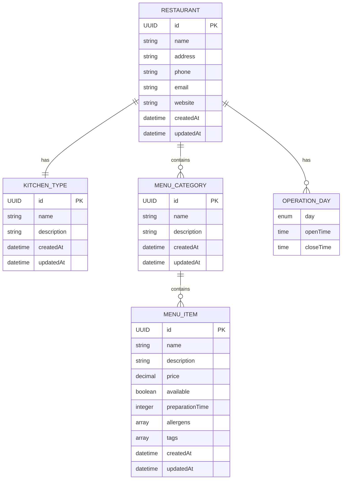

# 🗄️ Modelagem de Dados

Estrutura de dados otimizada para MongoDB, priorizando performance de leitura através de documentos aninhados e desnormalização estratégica.

## 🎯 Filosofia de Modelagem

### NoSQL First

Diferente de bancos relacionais, a modelagem foi pensada especificamente para MongoDB:

- **Documentos aninhados** ao invés de relacionamentos
- **Desnormalização controlada** para performance
- **Estrutura hierárquica** natural
- **Consultas otimizadas** por documento

### Performance de Leitura

A estrutura prioriza consultas rápidas:

```javascript
// Uma única consulta retorna tudo
db.restaurants.findOne({_id: ObjectId("...")})
// Retorna: restaurante + menu completo + itens
```

## 📊 Estrutura Geral



## 🏪 Restaurant Document

### Estrutura Completa

```json
{
  "_id": "550e8400-e29b-41d4-a716-446655440000",
  "name": "Bella Italia Ristorante",
  "address": "Rua Augusta, 123 - Consolação, São Paulo, SP",
  "phone": "(11) 99999-9999",
  "email": "contato@bellaitalia.com",
  "website": "https://bellaitalia.com",
  "kitchenType": {
    "id": "550e8400-e29b-41d4-a716-446655440001",
    "name": "Italiana",
    "description": "Culinária tradicional italiana"
  },
  "operationDays": [
    {
      "day": "MONDAY",
      "openTime": "18:00",
      "closeTime": "23:00"
    },
    {
      "day": "TUESDAY",
      "openTime": "18:00",
      "closeTime": "23:00"
    },
    {
      "day": "FRIDAY",
      "openTime": "18:00",
      "closeTime": "00:00"
    },
    {
      "day": "SATURDAY",
      "openTime": "18:00",
      "closeTime": "00:00"
    }
  ],
  "menu": [
    {
      "id": "550e8400-e29b-41d4-a716-446655440002",
      "name": "Antipasti",
      "description": "Entradas tradicionais italianas",
      "items": [
        {
          "id": "550e8400-e29b-41d4-a716-446655440003",
          "name": "Bruschetta Classica",
          "description": "Pão italiano tostado com tomate, manjericão e azeite extra virgem",
          "price": 18.90,
          "available": true,
          "preparationTime": 10,
          "allergens": ["glúten"],
          "tags": ["vegetariano", "tradicional"],
          "createdAt": "2024-08-05T16:10:00Z",
          "updatedAt": "2024-08-05T16:10:00Z"
        },
        {
          "id": "550e8400-e29b-41d4-a716-446655440004",
          "name": "Antipasto della Casa",
          "description": "Seleção de frios, queijos, azeitonas e vegetais marinados",
          "price": 32.90,
          "available": true,
          "preparationTime": 5,
          "allergens": ["lactose"],
          "tags": ["tradicional", "para-compartilhar"],
          "createdAt": "2024-08-05T16:15:00Z",
          "updatedAt": "2024-08-05T16:15:00Z"
        }
      ],
      "createdAt": "2024-08-05T16:05:00Z",
      "updatedAt": "2024-08-05T16:15:00Z"
    },
    {
      "id": "550e8400-e29b-41d4-a716-446655440005",
      "name": "Primi Piatti",
      "description": "Massas e risotos",
      "items": [
        {
          "id": "550e8400-e29b-41d4-a716-446655440006",
          "name": "Spaghetti Carbonara",
          "description": "Massa com bacon, ovos, queijo parmesão e pimenta preta",
          "price": 45.90,
          "available": true,
          "preparationTime": 20,
          "allergens": ["glúten", "lactose", "ovos"],
          "tags": ["tradicional", "massa"],
          "createdAt": "2024-08-05T16:20:00Z",
          "updatedAt": "2024-08-05T16:20:00Z"
        }
      ],
      "createdAt": "2024-08-05T16:18:00Z",
      "updatedAt": "2024-08-05T16:20:00Z"
    }
  ],
  "createdAt": "2024-08-05T16:00:00Z",
  "updatedAt": "2024-08-05T16:20:00Z"
}
```

### Entidade Java

```java
@Document(collection = "restaurants")
@Data
@Builder
@NoArgsConstructor
@AllArgsConstructor
public class RestaurantEntity {
    
    @Id
    private UUID id;
    
    @NotBlank
    @Size(min = 2, max = 100)
    private String name;
    
    @Size(max = 200)
    private String address;
    
    @Pattern(regexp = "^\\([0-9]{2}\\) [0-9]{4,5}-[0-9]{4}$")
    private String phone;
    
    @Email
    private String email;
    
    @URL
    private String website;
    
    @NotNull
    private KitchenTypeEntity kitchenType;
    
    private List<OperationDaysTimeData> operationDays;
    
    private List<MenuCategoryEntity> menu;
    
    @CreatedDate
    private LocalDateTime createdAt;
    
    @LastModifiedDate
    private LocalDateTime updatedAt;
    
    // Métodos de negócio
    public boolean isOpenAt(LocalDateTime dateTime) {
        if (operationDays == null || operationDays.isEmpty()) {
            return false;
        }
        
        DayEnum day = DayEnum.fromDayOfWeek(dateTime.getDayOfWeek());
        LocalTime time = dateTime.toLocalTime();
        
        return operationDays.stream()
            .filter(op -> op.getDay().equals(day))
            .anyMatch(op -> isTimeBetween(time, op.getOpenTime(), op.getCloseTime()));
    }
    
    public void addMenuCategory(MenuCategoryEntity category) {
        if (menu == null) {
            menu = new ArrayList<>();
        }
        
        // Validação de negócio
        boolean exists = menu.stream()
            .anyMatch(existing -> existing.getName().equalsIgnoreCase(category.getName()));
        
        if (exists) {
            throw new ConflictRequestException("Menu category already exists");
        }
        
        category.setId(UUID.randomUUID());
        category.setCreatedAt(LocalDateTime.now());
        category.setUpdatedAt(LocalDateTime.now());
        menu.add(category);
        
        this.updatedAt = LocalDateTime.now();
    }
    
    public MenuItemEntity findMenuItemById(UUID itemId) {
        if (menu == null) return null;
        
        return menu.stream()
            .flatMap(category -> category.getItems().stream())
            .filter(item -> item.getId().equals(itemId))
            .findFirst()
            .orElse(null);
    }
}
```

## 🍳 Kitchen Type Document

### Estrutura

```json
{
  "_id": "550e8400-e29b-41d4-a716-446655440001",
  "name": "Italiana",
  "description": "Culinária tradicional italiana com massas, pizzas e risotos",
  "createdAt": "2024-08-05T15:00:00Z",
  "updatedAt": "2024-08-05T15:00:00Z"
}
```

### Entidade Java

```java
@Document(collection = "kitchen_types")
@Data
@Builder
@NoArgsConstructor
@AllArgsConstructor
public class KitchenTypeEntity {
    
    @Id
    private UUID id;
    
    @NotBlank
    @Size(min = 2, max = 50)
    @Indexed(unique = true)
    private String name;
    
    @Size(max = 200)
    private String description;
    
    @CreatedDate
    private LocalDateTime createdAt;
    
    @LastModifiedDate
    private LocalDateTime updatedAt;
}
```

## 📋 Menu Category (Embedded)

### Estrutura

```json
{
  "id": "550e8400-e29b-41d4-a716-446655440002",
  "name": "Antipasti",
  "description": "Entradas tradicionais italianas",
  "items": [
    {
      "id": "550e8400-e29b-41d4-a716-446655440003",
      "name": "Bruschetta",
      "description": "Pão italiano com tomate",
      "price": 18.90,
      "available": true,
      "preparationTime": 10,
      "allergens": ["glúten"],
      "tags": ["vegetariano"],
      "createdAt": "2024-08-05T16:10:00Z",
      "updatedAt": "2024-08-05T16:10:00Z"
    }
  ],
  "createdAt": "2024-08-05T16:05:00Z",
  "updatedAt": "2024-08-05T16:15:00Z"
}
```

### Entidade Java

```java
@Data
@Builder
@NoArgsConstructor
@AllArgsConstructor
public class MenuCategoryEntity {
    
    private UUID id;
    
    @NotBlank
    @Size(min = 2, max = 50)
    private String name;
    
    @Size(max = 200)
    private String description;
    
    private List<MenuItemEntity> items;
    
    private LocalDateTime createdAt;
    private LocalDateTime updatedAt;
    
    public void addMenuItem(MenuItemEntity item) {
        if (items == null) {
            items = new ArrayList<>();
        }
        
        // Validação de negócio
        boolean exists = items.stream()
            .anyMatch(existing -> existing.getName().equalsIgnoreCase(item.getName()));
        
        if (exists) {
            throw new ConflictRequestException("Menu item already exists in this category");
        }
        
        item.setId(UUID.randomUUID());
        item.setCreatedAt(LocalDateTime.now());
        item.setUpdatedAt(LocalDateTime.now());
        items.add(item);
        
        this.updatedAt = LocalDateTime.now();
    }
    
    public boolean removeMenuItem(UUID itemId) {
        if (items == null) return false;
        
        boolean removed = items.removeIf(item -> item.getId().equals(itemId));
        if (removed) {
            this.updatedAt = LocalDateTime.now();
        }
        return removed;
    }
}
```

## 🍽️ Menu Item (Embedded)

### Estrutura

```json
{
  "id": "550e8400-e29b-41d4-a716-446655440003",
  "name": "Spaghetti Carbonara Premium",
  "description": "Massa italiana artesanal com guanciale, ovos orgânicos e parmigiano reggiano 24 meses",
  "price": 52.90,
  "available": true,
  "preparationTime": 25,
  "allergens": ["glúten", "lactose", "ovos"],
  "tags": ["premium", "italiana", "massa", "artesanal"],
  "nutritionalInfo": {
    "calories": 650,
    "protein": 28.5,
    "carbs": 75.2,
    "fat": 25.8,
    "fiber": 3.2
  },
  "createdAt": "2024-08-05T16:10:00Z",
  "updatedAt": "2024-08-05T16:30:00Z"
}
```

### Entidade Java

```java
@Data
@Builder
@NoArgsConstructor
@AllArgsConstructor
public class MenuItemEntity {
    
    private UUID id;
    
    @NotBlank
    @Size(min = 2, max = 100)
    private String name;
    
    @Size(max = 300)
    private String description;
    
    @NotNull
    @DecimalMin(value = "0.01", message = "Price must be greater than zero")
    @Digits(integer = 6, fraction = 2)
    private BigDecimal price;
    
    @Builder.Default
    private Boolean available = true;
    
    @Min(value = 1, message = "Preparation time must be positive")
    private Integer preparationTime;
    
    private List<String> allergens;
    
    private List<String> tags;
    
    private NutritionalInfo nutritionalInfo;
    
    private LocalDateTime createdAt;
    private LocalDateTime updatedAt;
    
    // Métodos de negócio
    public boolean isVegetarian() {
        return tags != null && tags.contains("vegetariano");
    }
    
    public boolean isVegan() {
        return tags != null && tags.contains("vegano");
    }
    
    public boolean isGlutenFree() {
        return allergens == null || !allergens.contains("glúten");
    }
    
    public boolean hasAllergen(String allergen) {
        return allergens != null && allergens.contains(allergen.toLowerCase());
    }
}

@Data
@Builder
@NoArgsConstructor
@AllArgsConstructor
public class NutritionalInfo {
    private Integer calories;
    private Double protein;
    private Double carbs;
    private Double fat;
    private Double fiber;
    private Double sodium;
}
```

## ⏰ Operation Days (Embedded)

### Estrutura

```json
{
  "day": "MONDAY",
  "openTime": "18:00",
  "closeTime": "23:00"
}
```

### Entidade Java

```java
@Data
@Builder
@NoArgsConstructor
@AllArgsConstructor
public class OperationDaysTimeData {
    
    @NotNull
    private DayEnum day;
    
    @NotNull
    private LocalTime openTime;
    
    @NotNull
    private LocalTime closeTime;
    
    // Validação customizada
    @AssertTrue(message = "Close time must be after open time")
    public boolean isValidTimeRange() {
        if (openTime == null || closeTime == null) {
            return true; // Deixa para outras validações
        }
        
        // Permite horários que cruzam meia-noite
        return !openTime.equals(closeTime);
    }
    
    public boolean isOpenAt(LocalTime time) {
        if (closeTime.isBefore(openTime)) {
            // Horário que cruza meia-noite (ex: 22:00 às 02:00)
            return time.isAfter(openTime) || time.isBefore(closeTime);
        }
        return time.isAfter(openTime) && time.isBefore(closeTime);
    }
}

public enum DayEnum {
    MONDAY, TUESDAY, WEDNESDAY, THURSDAY, FRIDAY, SATURDAY, SUNDAY;
    
    public static DayEnum fromDayOfWeek(DayOfWeek dayOfWeek) {
        return DayEnum.valueOf(dayOfWeek.name());
    }
    
    public DayOfWeek toDayOfWeek() {
        return DayOfWeek.valueOf(this.name());
    }
}
```

## 🔍 Índices e Performance

### Índices Estratégicos

```java
@Configuration
public class MongoIndexConfig {
    
    @Autowired
    private MongoTemplate mongoTemplate;
    
    @PostConstruct
    public void initIndexes() {
        // Restaurant indexes
        mongoTemplate.indexOps(RestaurantEntity.class)
            .ensureIndex(new Index().on("name", Sort.Direction.ASC).unique());
        
        mongoTemplate.indexOps(RestaurantEntity.class)
            .ensureIndex(new Index().on("kitchenType.id", Sort.Direction.ASC));
        
        mongoTemplate.indexOps(RestaurantEntity.class)
            .ensureIndex(new Index().on("address", Sort.Direction.ASC));
        
        // Kitchen Type indexes
        mongoTemplate.indexOps(KitchenTypeEntity.class)
            .ensureIndex(new Index().on("name", Sort.Direction.ASC).unique());
        
        // Compound indexes for complex queries
        mongoTemplate.indexOps(RestaurantEntity.class)
            .ensureIndex(new Index()
                .on("kitchenType.name", Sort.Direction.ASC)
                .on("operationDays.day", Sort.Direction.ASC));
        
        // Text index for search
        mongoTemplate.indexOps(RestaurantEntity.class)
            .ensureIndex(new Index()
                .on("name", Sort.Direction.ASC)
                .on("menu.name", Sort.Direction.ASC)
                .on("menu.items.name", Sort.Direction.ASC));
    }
}
```

### Consultas Otimizadas

```java
@Repository
public class RestaurantRepositoryImpl implements RestaurantRepository {
    
    @Autowired
    private MongoTemplate mongoTemplate;
    
    // Busca com projeção para listar básico
    public List<RestaurantBasicResponse> findAllBasic() {
        Query query = new Query();
        query.fields()
            .include("id", "name", "address", "phone", "kitchenType")
            .exclude("menu"); // Não carregar menu para listagem
        
        return mongoTemplate.find(query, RestaurantEntity.class)
            .stream()
            .map(RestaurantMapper::toBasicResponse)
            .collect(Collectors.toList());
    }
    
    // Busca por tipo de cozinha
    public List<RestaurantEntity> findByKitchenTypeName(String kitchenTypeName) {
        Query query = new Query(Criteria.where("kitchenType.name").is(kitchenTypeName));
        return mongoTemplate.find(query, RestaurantEntity.class);
    }
    
    // Busca restaurantes abertos agora
    public List<RestaurantEntity> findOpenNow() {
        LocalDateTime now = LocalDateTime.now();
        DayEnum today = DayEnum.fromDayOfWeek(now.getDayOfWeek());
        LocalTime currentTime = now.toLocalTime();
        
        Query query = new Query(Criteria.where("operationDays")
            .elemMatch(Criteria.where("day").is(today)
                .and("openTime").lte(currentTime)
                .and("closeTime").gte(currentTime)));
        
        return mongoTemplate.find(query, RestaurantEntity.class);
    }
    
    // Busca item específico com contexto
    public MenuItemWithContextDTO findMenuItemWithContext(UUID itemId) {
        // Aggregation pipeline para buscar item com contexto
        Aggregation aggregation = Aggregation.newAggregation(
            Aggregation.unwind("menu"),
            Aggregation.unwind("menu.items"),
            Aggregation.match(Criteria.where("menu.items.id").is(itemId)),
            Aggregation.project()
                .and("id").as("restaurantId")
                .and("name").as("restaurantName")
                .and("address").as("restaurantAddress")
                .and("menu.id").as("categoryId")
                .and("menu.name").as("categoryName")
                .and("menu.items").as("item")
        );
        
        AggregationResults<MenuItemWithContextDTO> results = 
            mongoTemplate.aggregate(aggregation, "restaurants", MenuItemWithContextDTO.class);
        
        return results.getUniqueMappedResult();
    }
}
```

## 📊 Vantagens da Modelagem

### 1. **Performance de Leitura**

```javascript
// Uma única consulta retorna tudo
db.restaurants.findOne({_id: ObjectId("...")})
// vs múltiplas consultas em SQL:
// SELECT * FROM restaurants WHERE id = ?
// SELECT * FROM menu_categories WHERE restaurant_id = ?
// SELECT * FROM menu_items WHERE category_id IN (...)
```

### 2. **Consistência Transacional**

```java
// Operação atômica no documento
@Transactional
public void addMenuItemToCategory(UUID restaurantId, UUID categoryId, MenuItemRequest request) {
    RestaurantEntity restaurant = restaurantRepository.findById(restaurantId)
        .orElseThrow(() -> new NotFoundException("Restaurant not found"));
    
    MenuCategoryEntity category = restaurant.findMenuCategoryById(categoryId);
    if (category == null) {
        throw new NotFoundException("Menu category not found");
    }
    
    MenuItemEntity item = MenuItemMapper.toEntity(request);
    category.addMenuItem(item); // Validação de negócio na entidade
    
    restaurantRepository.save(restaurant); // Uma única operação
}
```

### 3. **Flexibilidade de Schema**

```java
// Fácil adição de novos campos
public class MenuItemEntity {
    // Campos existentes...
    
    // Novos campos podem ser adicionados sem migração
    private NutritionalInfo nutritionalInfo; // Opcional
    private List<String> images; // URLs das imagens
    private Map<String, Object> customAttributes; // Campos dinâmicos
}
```

## 🔄 Estratégias de Migração

### Versionamento de Schema

```java
@Document(collection = "restaurants")
public class RestaurantEntity {
    
    @Version
    private Long version;
    
    // Campo para controle de versão do schema
    @Builder.Default
    private Integer schemaVersion = 1;
    
    // Método para migração automática
    @PostLoad
    public void migrateSchema() {
        if (schemaVersion == null || schemaVersion < 2) {
            // Migração para versão 2
            migrateToV2();
            schemaVersion = 2;
        }
    }
    
    private void migrateToV2() {
        // Exemplo: adicionar campo default para itens sem preparationTime
        if (menu != null) {
            menu.forEach(category -> {
                if (category.getItems() != null) {
                    category.getItems().forEach(item -> {
                        if (item.getPreparationTime() == null) {
                            item.setPreparationTime(15); // Default
                        }
                    });
                }
            });
        }
    }
}
```

### Scripts de Migração

```javascript
// migration_v1_to_v2.js
db.restaurants.find({schemaVersion: {$exists: false}}).forEach(function(doc) {
    // Adicionar campo schemaVersion
    doc.schemaVersion = 1;
    
    // Migrar estrutura se necessário
    if (doc.menu) {
        doc.menu.forEach(function(category) {
            if (category.items) {
                category.items.forEach(function(item) {
                    if (!item.available) {
                        item.available = true; // Default
                    }
                    if (!item.preparationTime) {
                        item.preparationTime = 15; // Default
                    }
                });
            }
        });
    }
    
    db.restaurants.save(doc);
});
```

## 🚀 Próximos Passos

- [Clean Architecture](clean-architecture.md) - Implementação da arquitetura
- [Visão Geral](overview.md) - Arquitetura completa
- [API Reference](../api/overview.md) - Como usar os dados via API
