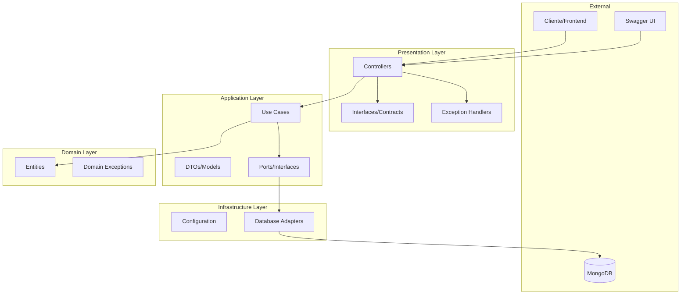
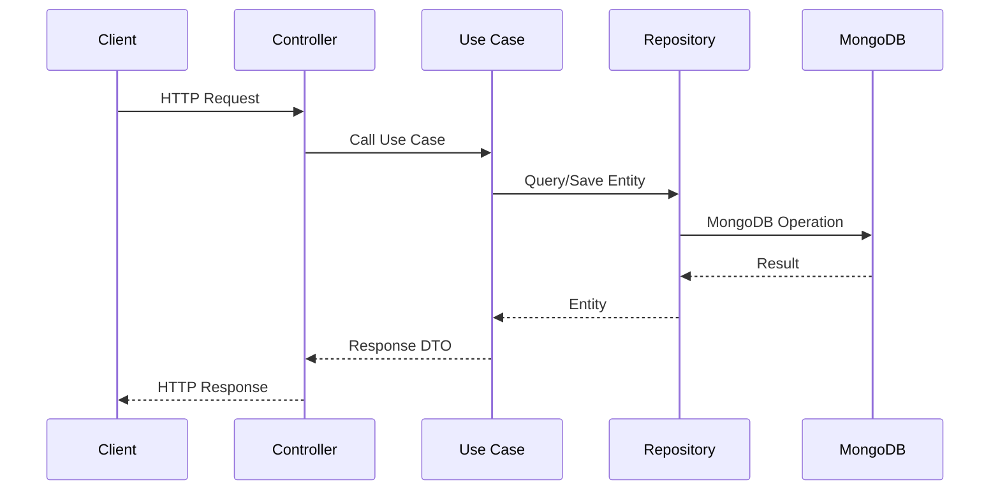

# 🏗️ Arquitetura - Visão Geral

O Tech Challenge Restaurant API foi desenvolvido seguindo os princípios da **Arquitetura Hexagonal (Ports & Adapters)** combinada com **Clean Architecture**, garantindo alta testabilidade, manutenibilidade e independência de frameworks.

## 🎯 Princípios Arquiteturais

### 1. Separação de Responsabilidades
Cada camada tem uma responsabilidade específica e bem definida.

### 2. Inversão de Dependências
As dependências apontam sempre para dentro, das camadas externas para as internas.

### 3. Independência de Frameworks
A lógica de negócio não depende de frameworks específicos.

### 4. Testabilidade
Cada componente pode ser testado isoladamente através de mocks e stubs.

## 📊 Visão Geral da Arquitetura



## 🏛️ Camadas da Arquitetura

### 📱 Presentation Layer (Camada de Apresentação)

**Responsabilidade**: Interface com o mundo externo (HTTP, REST API).

**Componentes**:
- **Controllers**: Recebem requisições HTTP e delegam para Use Cases
- **Contracts/Interfaces**: Definem contratos claros para os endpoints
- **Exception Handlers**: Tratam exceções e formatam respostas de erro

**Localização**: `src/main/java/.../presentation/`

```java
@RestController
@RequestMapping("/api/restaurants")
public class RestaurantController implements RestaurantControllerInterface {
    
    private final RestaurantUseCase restaurantUseCase;
    
    @PostMapping
    public ResponseEntity<RestaurantFullResponse> createRestaurant(
            @Valid @RequestBody RestaurantRequest request) {
        RestaurantFullResponse response = restaurantUseCase.createRestaurant(request);
        return ResponseEntity.status(HttpStatus.CREATED).body(response);
    }
}
```

### 🔧 Application Layer (Camada de Aplicação)

**Responsabilidade**: Orquestração da lógica de negócio e coordenação entre camadas.

**Componentes**:
- **Use Cases**: Implementam casos de uso específicos
- **DTOs/Models**: Objetos de transferência de dados
- **Ports**: Interfaces que definem contratos com a infraestrutura

**Localização**: `src/main/java/.../application/`

```java
@Service
public class RestaurantUseCase {
    
    private final RestaurantRepository restaurantRepository;
    private final KitchenTypeRepository kitchenTypeRepository;
    
    public RestaurantFullResponse createRestaurant(RestaurantRequest request) {
        // Validar kitchen type existe
        KitchenTypeEntity kitchenType = kitchenTypeRepository
            .findById(request.getKitchenTypeId())
            .orElseThrow(() -> new NotFoundException("Kitchen type not found"));
        
        // Criar entidade
        RestaurantEntity restaurant = RestaurantEntity.builder()
            .name(request.getName())
            .address(request.getAddress())
            .kitchenType(kitchenType)
            .build();
        
        // Salvar
        RestaurantEntity saved = restaurantRepository.save(restaurant);
        
        // Retornar response
        return RestaurantMapper.toFullResponse(saved);
    }
}
```

### 🏛️ Domain Layer (Camada de Domínio)

**Responsabilidade**: Regras de negócio puras e entidades do domínio.

**Componentes**:
- **Entities**: Representam conceitos do domínio
- **Domain Exceptions**: Exceções específicas do domínio
- **Value Objects**: Objetos de valor (se aplicável)

**Localização**: `src/main/java/.../domain/`

```java
@Document(collection = "restaurants")
public class RestaurantEntity {
    
    @Id
    private UUID id;
    
    @NotBlank
    private String name;
    
    private String address;
    private String phone;
    private String email;
    private String website;
    
    private KitchenTypeEntity kitchenType;
    private List<OperationDaysTimeData> operationDays;
    private List<MenuCategoryEntity> menu;
    
    private LocalDateTime createdAt;
    private LocalDateTime updatedAt;
    
    // Métodos de negócio
    public boolean isOpenAt(LocalDateTime dateTime) {
        DayOfWeek dayOfWeek = dateTime.getDayOfWeek();
        LocalTime time = dateTime.toLocalTime();
        
        return operationDays.stream()
            .filter(op -> op.getDay().equals(dayOfWeek))
            .anyMatch(op -> time.isAfter(op.getOpenTime()) && 
                           time.isBefore(op.getCloseTime()));
    }
}
```

### 🔌 Infrastructure Layer (Camada de Infraestrutura)

**Responsabilidade**: Implementações concretas de interfaces e configurações.

**Componentes**:
- **Configuration**: Configurações do Spring, MongoDB, etc.
- **Adapters**: Implementações dos ports (repositórios, etc.)

**Localização**: `src/main/java/.../infrastructure/`

```java
@Configuration
public class MongoConfig {
    
    @Bean
    public MongoTemplate mongoTemplate(MongoClient mongoClient) {
        return new MongoTemplate(mongoClient, "tech_challenge_restaurants");
    }
    
    @Bean
    public MongoTransactionManager transactionManager(MongoDbFactory dbFactory) {
        return new MongoTransactionManager(dbFactory);
    }
}
```

## 🔄 Fluxo de Dados

### Requisição (Request Flow)



### Exemplo Prático - Criar Restaurante

1. **Client** envia POST `/api/restaurants`
2. **RestaurantController** recebe e valida dados
3. **RestaurantUseCase** processa a lógica:
   - Valida se kitchen type existe
   - Cria entidade RestaurantEntity
   - Salva no repositório
4. **RestaurantRepository** persiste no MongoDB
5. **Response** é formatado e retornado

## 🧪 Testabilidade

### Testes Unitários

Cada camada pode ser testada isoladamente:

```java
@ExtendWith(MockitoExtension.class)
class RestaurantUseCaseTest {
    
    @Mock
    private RestaurantRepository restaurantRepository;
    
    @Mock
    private KitchenTypeRepository kitchenTypeRepository;
    
    @InjectMocks
    private RestaurantUseCase restaurantUseCase;
    
    @Test
    void shouldCreateRestaurantSuccessfully() {
        // Given
        RestaurantRequest request = createValidRequest();
        KitchenTypeEntity kitchenType = createKitchenType();
        
        when(kitchenTypeRepository.findById(any())).thenReturn(Optional.of(kitchenType));
        when(restaurantRepository.save(any())).thenAnswer(invocation -> invocation.getArgument(0));
        
        // When
        RestaurantFullResponse response = restaurantUseCase.createRestaurant(request);
        
        // Then
        assertThat(response).isNotNull();
        assertThat(response.getName()).isEqualTo(request.getName());
        verify(restaurantRepository).save(any(RestaurantEntity.class));
    }
}
```

### Testes de Integração

```java
@SpringBootTest(webEnvironment = SpringBootTest.WebEnvironment.RANDOM_PORT)
@Testcontainers
class RestaurantIntegrationTest {
    
    @Container
    static MongoDBContainer mongoDBContainer = new MongoDBContainer("mongo:7.0");
    
    @Autowired
    private TestRestTemplate restTemplate;
    
    @Test
    void shouldCreateRestaurantViaApi() {
        // Given
        RestaurantRequest request = createValidRequest();
        
        // When
        ResponseEntity<RestaurantFullResponse> response = restTemplate.postForEntity(
            "/api/restaurants", request, RestaurantFullResponse.class);
        
        // Then
        assertThat(response.getStatusCode()).isEqualTo(HttpStatus.CREATED);
        assertThat(response.getBody().getName()).isEqualTo(request.getName());
    }
}
```

## 📦 Estrutura de Pacotes

```
src/main/java/com/fiap/itmoura/tech_challenge_restaurant/
├── TechChallengeRestaurantApplication.java
├── presentation/
│   ├── contracts/          # Interfaces dos controllers
│   ├── controllers/        # Implementações REST
│   └── handlers/          # Exception handlers
├── application/
│   ├── models/            # DTOs e requests/responses
│   ├── ports/             # Interfaces (ports)
│   └── usecases/          # Casos de uso (services)
├── domain/
│   ├── entities/          # Entidades do domínio
│   └── exceptions/        # Exceções de domínio
└── infrastructure/
    └── config/            # Configurações
```

## 🔧 Tecnologias e Frameworks

### Core
- **Java 21**: Linguagem de programação
- **Spring Boot 3.5.4**: Framework principal
- **Spring Data MongoDB**: Integração com MongoDB
- **Spring Validation**: Validação de dados

### Documentação
- **OpenAPI 3**: Especificação da API
- **Swagger UI**: Interface interativa

### Testes
- **JUnit 5**: Framework de testes
- **Mockito**: Mocking framework
- **Testcontainers**: Testes de integração
- **Cucumber**: Testes BDD

### Build e Deploy
- **Gradle**: Build tool
- **Docker**: Containerização
- **Docker Compose**: Orquestração local

## 🚀 Benefícios da Arquitetura

### 1. **Manutenibilidade**
- Código organizado e bem estruturado
- Responsabilidades claras
- Fácil localização de funcionalidades

### 2. **Testabilidade**
- Componentes isolados
- Fácil criação de mocks
- Testes rápidos e confiáveis

### 3. **Flexibilidade**
- Fácil troca de implementações
- Independência de frameworks
- Adaptação a novos requisitos

### 4. **Escalabilidade**
- Estrutura preparada para crescimento
- Separação clara de responsabilidades
- Facilita trabalho em equipe

## 🔄 Padrões Utilizados

### Repository Pattern
```java
public interface RestaurantRepository extends MongoRepository<RestaurantEntity, UUID> {
    List<RestaurantEntity> findByKitchenTypeId(UUID kitchenTypeId);
    Optional<RestaurantEntity> findByName(String name);
}
```

### DTO Pattern
```java
public class RestaurantRequest {
    @NotBlank
    private String name;
    
    @Email
    private String email;
    
    @NotNull
    private UUID kitchenTypeId;
}
```

### Builder Pattern
```java
RestaurantEntity restaurant = RestaurantEntity.builder()
    .name(request.getName())
    .address(request.getAddress())
    .kitchenType(kitchenType)
    .build();
```

## 📊 Métricas e Monitoramento

### Actuator Endpoints
- `/actuator/health` - Status da aplicação
- `/actuator/metrics` - Métricas da aplicação
- `/actuator/prometheus` - Métricas para Prometheus

### Logging
```yaml
logging:
  level:
    com.fiap.itmoura.tech_challenge_restaurant: DEBUG
    org.springframework.data.mongodb: DEBUG
```

## 🚀 Próximos Passos

- [Clean Architecture](clean-architecture.md) - Detalhes da implementação
- [Modelagem de Dados](data-modeling.md) - Estrutura do MongoDB
- [API Reference](../api/overview.md) - Documentação dos endpoints
