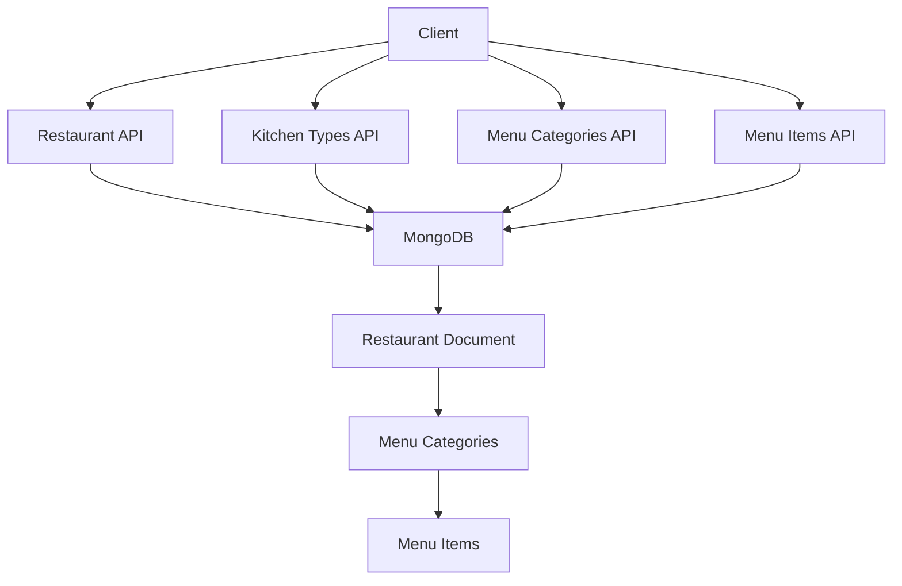

# 🍽️ Tech Challenge - Restaurant Management API


Sistema de gerenciamento de restaurantes desenvolvido com **Spring Boot + MongoDB**, focado em alta performance de leitura através de estrutura de documentos aninhados com **endpoints específicos** para gerenciamento transparente de menu e itens.

## 🎯 Visão Geral

O sistema permite o gerenciamento completo de restaurantes com suas informações básicas e menus estruturados em categorias. A modelagem foi pensada para MongoDB (NoSQL), evitando abordagens relacionais e priorizando performance de leitura através de documentos aninhados.

### ✨ Principais Funcionalidades

- ✅ **Gerenciamento de Restaurantes**: CRUD completo com informações básicas
- ✅ **Kitchen Types**: Gerenciamento de tipos de cozinha
- ✅ **Menu Estruturado**: Categorias e itens organizados hierarquicamente
- ✅ **Endpoints Específicos**: Gerenciamento transparente de menu e itens
- ✅ **Consultas Otimizadas**: Endpoints específicos para diferentes necessidades
- ✅ **Busca por Item**: Localização de itens específicos com contexto completo
- ✅ **UUIDs**: Identificadores únicos para todos os recursos
- ✅ **Documentação OpenAPI**: Swagger UI integrado

### 🔄 Abstração Transparente

O cliente da API interage com menu e itens de forma **independente**, como se fossem entidades externas, mas internamente o sistema mantém tudo **aninhado no documento do restaurante** no MongoDB. Isso garante:

- **Performance**: Uma única consulta retorna todos os dados necessários
- **Simplicidade**: Interface limpa e intuitiva para o cliente
- **Eficiência**: Estrutura otimizada para NoSQL

## 🚀 Quick Start

### Pré-requisitos

- **Java 21** ou superior
- **Docker** e **Docker Compose**
- **Git**

### Execução Rápida

```bash
# Clone o repositório
git clone https://github.com/itmoura/fiap-tech-challenge-restaurants.git
cd fiap-tech-challenge-restaurants

# Execute com Docker
docker-compose up -d

# Ou execute localmente
./gradlew bootRun
```

A API estará disponível em: `http://localhost:8081`

Swagger UI: `http://localhost:8081/swagger-ui.html`

## 📚 Documentação

### 🔧 [Instalação](installation/prerequisites.md)
Guia completo de instalação e configuração do ambiente

### 📚 [API Reference](api/overview.md)
Documentação detalhada de todos os endpoints

### 🏗️ [Arquitetura](architecture/overview.md)
Visão técnica da arquitetura e modelagem

## 🛠️ Tecnologias Utilizadas

| Tecnologia | Versão | Descrição |
|------------|--------|-----------|
| **Java** | 21 | Linguagem de programação |
| **Spring Boot** | 3.5.4 | Framework web |
| **MongoDB** | 7.0 | Banco de dados NoSQL |
| **Gradle** | 8.x | Build tool |
| **Docker** | - | Containerização |
| **Swagger/OpenAPI** | 3.0 | Documentação da API |

## 📊 Estrutura da API



## 🤝 Contribuição

Contribuições são bem-vindas! Por favor, leia as diretrizes de contribuição antes de submeter um PR.

## 📄 Licença

Este projeto está licenciado sob a Licença MIT - veja o arquivo [LICENSE](about/license.md) para detalhes.

## 👤 Autor

**Ítalo Moura**

- 🔗 [LinkedIn](https://www.linkedin.com/in/itmoura/)
- 📸 [Instagram](https://www.instagram.com/it_moura/)
- 💻 [GitHub](https://github.com/itmoura)

---

<div align="center">
  <p>Desenvolvido com ❤️ para o FIAP Tech Challenge</p>
</div>
